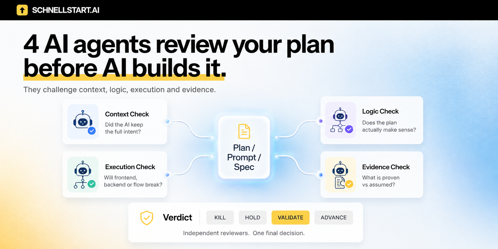

# Problem Due-Diligence Engine



<!-- placeholder: labels still describe code review; final image uses the four lens names below -->

**Feed it a business idea. It tries to kill the idea before reality does — and shows you
exactly why, with every claim traced to evidence. Free, open-source idea due diligence
for founders and indie hackers: frozen case, four lenses, one verdict, cheapest next test.**

Most ideas die after months of building, when the market finally delivers the verdict.
This engine delivers a verdict in an afternoon, from four independent AI reviewers who
never talk to each other, judging only the evidence you can actually show.

There is nothing to install: this repo is a set of instruction files you paste into an AI
assistant (Claude, ChatGPT, or a developer tool like Claude Code), plus the rules that keep
the process honest.

## How it works — 60 seconds

**1. You write the problem down, once, honestly.**
One page ([template](templates/case-template.yaml)): who has the problem, in what moment,
who pays, and an evidence pack where every item says where it comes from and what it does
NOT prove ([rules](templates/evidence-rules.md)). The case is frozen with a git commit —
after that, every edit leaves a visible, timestamped trail; rewriting it without a trace
is deliberate work, not an accident.

**2. Four blind reviewers attack it from four angles.**
Each sees only the frozen case. None sees the others.

| Reviewer | The question it asks |
|---|---|
| [Outcome & Premise](prompts/outcome-premise.md) | Is this a real, valuable problem — or an interesting feature? |
| [Lifecycle & Mechanism](prompts/lifecycle-mechanism.md) | What triggers use, creates value, causes return — and abandonment? |
| [Authority & Boundary](prompts/authority-boundary.md) | Who experiences it, decides, pays, distributes, blocks, carries the risk? |
| [Evidence Validity](prompts/evidence-validity.md) | Does the evidence prove demand — or only attention and politeness? |

**3. You get one verdict and the cheapest way to test what's still unknown.**
A [synthesiser](prompts/synthesiser.md) merges the four reports into one verdict —
**KILL** (drop it), **HOLD** (something outside the idea must be resolved first),
**VALIDATE** (do not build yet; run the cheap tests it lists), **ADVANCE** (the evidence
already supports the next step) — lists the findings that multiple blind reviewers hit
independently (the strongest signal), and names the up-to-3 cheapest real-world
experiments, each with a threshold that counts as a pass. In the pilot backtest, one real
case burned weeks of outreach before learning the channel was dead; the engine's cheapest
prescribed test was a half-day desk check that would likely have surfaced the same answer
before a single message was sent. Weeks of doing versus half a day of checking — that gap
is what it saves you.

## Does it actually work? The numbers, honestly

There is no guarantee, and anyone selling you one is doing the thing this engine exists to
catch. What exists is a track record, in three tiers of strength:

**Tier 1 — benchmarked, adjacent domain.** The four-lens blind-review method was tested on
5 real commits against a normal code review (same frozen input, reviewers blind). On
claims-heavy documents it found up to 14 issues where the normal review found 1, and it
*lost* on plain mechanical code — evidence the wins aren't noise.

**Tier 2 — backtests, this domain.** The engine was run on 4 real past decisions of one Swiss
solo consultancy whose outcomes were already known (three failures, one decision that held),
written with only decision-time information, answer keys fixed before each run. Result:
**4 / 4 verdicts inside the accepted set; in every case the blind reviewers independently
named the reason reality later confirmed.** Then the honest part: a control arm — one chat,
one blunt "attack my idea" prompt, same isolation — scored **3 / 4 on the same cases**. So the
four-reviewer protocol is not yet shown to be *better* at verdicts than a single blunt chat.
What it adds is a convergence signal (4/4 vs 2/4 independent BLOCKING tells you how sure to
be), findings tied to four distinct relationships, and an audit trail. Also measured:
run-to-run variance (one case went KILL one day, VALIDATE the next). **Run a case twice
before acting on it.** The cases themselves are the operator's private business history and
are not published; summary in [eval/SUMMARY.md](eval/SUMMARY.md).

**Tier 3 — the live ledger.** Every run is logged in [RUNS.md](RUNS.md) — append-only,
meaning verdict lines are never changed; only the outcome column is filled in when
reality resolves a case — with
case version, commit hash and verdict — *before* the outcome is known. Over time, that
ledger — verdicts vs. what actually happened — becomes the only number that fully counts.
It also makes the classic self-deception visible: a case that went KILL → (edit) → ADVANCE
shows up in the ledger as exactly that.

The engine also reviewed **its own release plan** with its own method and blocked it —
four out of four reviewers. That self-review is in
[docs/SELF-REVIEW.md](docs/SELF-REVIEW.md) and is the reason this README claims exactly
what ran and nothing more.

## What a verdict is — and is not

A verdict is a structured risk review by language models. It is **not** market proof: only
the experiments it prescribes produce that. The engine cannot detect invented evidence —
the [evidence rules](templates/evidence-rules.md) make invention costly and auditable, not
impossible. Four reviewers agreeing is convergence, not truth. Use verdicts to decide what
to **test next**, never as a certificate to show investors.

## Run it yourself

**Fastest (enforced blindness):** with [Claude Code](https://claude.com/claude-code) installed
and logged in (`claude --version` works), plus Node 18+, one command runs the whole thing — four reviewers as four separate processes with no
tools, no web, no memory, no shared context, then the synthesiser:

```
node run.mjs cases/examples/CASE-EXAMPLE-001.yaml   # add --model sonnet for a cheaper run
```

It refuses to run on an uncommitted (unfrozen) case (no git, e.g. a ZIP download? it freezes by
file fingerprint instead and copies the exact case into the run folder), shows a live progress line per reviewer,
writes the five reports to `runs/<case>-<version>-<timestamp>/`, and prints the ledger line
for `RUNS.md`. Blindness here is a process boundary, not a promise in the prompt — and you can
check it: `node test/blindness.mjs` plants a secret next to a reviewer process and tries to make
it leak tools, files, project instructions or other reports. It must come back empty.

**Manual (any assistant):**

You need nothing installed — just an AI assistant where you can open separate fresh chats
(Claude, ChatGPT, or a developer tool like Claude Code). First download this repo (green
**Code** button → **Download ZIP**) so you have the template and the six prompt files —
the steps below use five of them; the researcher one is optional.

1. Copy [templates/case-template.yaml](templates/case-template.yaml), fill it following
   [templates/evidence-rules.md](templates/evidence-rules.md). Then freeze it: if you use
   git, commit it; if not, email the finished file to yourself — a timestamped copy that makes
   later edits visible. After the freeze, you don't touch it.
2. Open a **fresh chat per reviewer** — four chats for the four [prompts/](prompts/)
   reviewer files. In each, paste the whole prompt file and replace the `{{CASE}}` line at
   the bottom with your case text. Fresh chats are what makes them blind: none can see the
   others — turn cross-chat memory off if your assistant has it. No web access.
   **Privacy:** the case goes into an AI chat. Anonymise client names and figures first, and
   do not paste anything a third party has not agreed to share. Four chats mean four copies.
3. In a fifth fresh chat, run [prompts/synthesiser.md](prompts/synthesiser.md) with the
   case + all four reports pasted in.
4. Add one line for the run to your copy of [RUNS.md](RUNS.md) — that file is your own
   logbook. If you edit the case afterwards: new version, new freeze, full rerun, new
   logbook line. Never delete old lines.

Optional, before freezing: [prompts/umfeld-researcher.md](prompts/umfeld-researcher.md)
gathers competitors/trends/regulation with sources — its output goes INTO the evidence pack.

## Stuck on the one page?

Writing the case with honest evidence is the hard part; whoever can do it alone needs the
reviewers least. If you want a second pair of hands, the maintainer writes and runs cases
with founders: [schnellstart.ai/de/due-diligence](https://schnellstart.ai/de/due-diligence)
(German, English on request). The tool stays free either way.

## Provenance

Adapted from the ACR-389 "risk-axis reviewers" experiment (blind, frozen-input,
premise-challenging review of software changes). Two deviations from the original, named
openly: reviewers here run in parallel (the original mandates serial), and the original's
hashed executed-evidence manifest is replaced by the evidence rules + git freeze — weaker,
because business evidence is human-reported. Both deviations are why Tier 1 numbers don't
automatically transfer here, and why Tiers 2-3 exist.

Kein Ersatz für eine Beratung; keine Haftung für Entscheidungen, die auf Ergebnissen dieses
Werkzeugs beruhen. Not a substitute for advice; no liability for decisions based on its output.

MIT licensed. Status: **experimental** — the method won a small benchmark in its original
domain; this adaptation is being validated in the open, in this repo.
